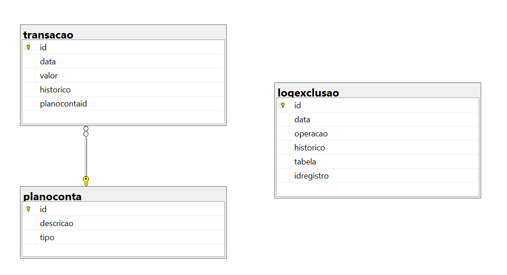

<!DOCTYPE html>
<html>

<head>
    <meta charset="UTF-8">
    <title>README - My Finance Web</title>
</head>

<body>
    <h1>My Finance Web</h1>
    
Projeto desenvolvido pelo Grupo 4, para a disciplina de PRÁTICAS DE IMPLEMENTAÇÃO E EVOLUÇÃO DE SOFTWARE do
        programa de pós-graduação em Engenharia de Software da PUC Minas. A plataforma My Finance Web tem como objetivo
        oferecer uma solução para controle de finanças pessoais online.

    <h2>Tecnologias Utilizadas</h2>
    <table>
        <tr>
            <td><i class="fab fa-microsoft"></i> <a href="https://dotnet.microsoft.com/apps/aspnet/mvc"
                    target="_blank">ASP.NET CORE MVC versão .NET 6.0</a></td>
        </tr>
        <tr>
            <td><i class="fas fa-database"></i> <a
                    href="https://www.microsoft.com/pt-br/sql-server/sql-server-downloads" target="_blank">Banco de
                    Dados SQL-SERVER 16</a></td>
        </tr>
        <tr>
            <td><i class="fas fa-code"></i> <a href="https://code.visualstudio.com/download" target="_blank">Visual
                    Studio Code</a></td>
        </tr>
    </table>
    <h2>Banco de Dados</h2>
    
A plataforma utiliza um banco de dados chamado myfinance, que possui três tabelas:

    
    <h3>Tabela planoconta</h3>
    <table style="border-collapse: collapse; width: 80%;">
        <thead>
            <tr style="border-bottom: 1px solid black; background-color: #857f7f;">
                <th style="padding: 5px; font-weight: bold;">Coluna</th>
                <th style="padding: 5px; font-weight: bold;">Tipo</th>
                <th style="padding: 5px; font-weight: bold;">Restrição</th>
            </tr>
        </thead>
        <tbody>
            <tr style="border-bottom: 1px solid black;">
                <td style="padding: 5px;">id</td>
                <td style="padding: 5px;">int</td>
                <td style="padding: 5px;">não nulo e chave primária</td>
            </tr>
            <tr style="border-bottom: 1px solid black;">
                <td style="padding: 5px;">descricao</td>
                <td style="padding: 5px;">varchar(50)</td>
                <td style="padding: 5px;">não nulo</td>
            </tr>
            <tr style="border-bottom: 1px solid black;">
                <td style="padding: 5px;">tipo</td>
                <td style="padding: 5px;">char(1)</td>
                <td style="padding: 5px;">não nulo</td>
            </tr>
        </tbody>
    </table>
    <h3>Tabela transacao</h3>
    <table style="border-collapse: collapse; width: 80%;">
        <thead style="border-bottom: 1px solid black; background-color: #857f7f;">
            <tr>
                <th style="font-weight: bold; padding: 5px;">Coluna</th>
                <th style="font-weight: bold; padding: 5px;">Tipo</th>
                <th style="font-weight: bold; padding: 5px;">Restrição</th>
            </tr>
        </thead>
        <tbody>
            <tr style="border-bottom: 1px solid black;">
                <td style="padding: 5px;">id</td>
                <td style="padding: 5px;">int</td>
                <td style="padding: 5px;">não nulo e chave primária</td>
            </tr>
            <tr style="border-bottom: 1px solid black;">
                <td style="padding: 5px;">data</td>
                <td style="padding: 5px;">datetime</td>
                <td style="padding: 5px;">não nulo</td>
            </tr>
            <tr style="border-bottom: 1px solid black;">
                <td style="padding: 5px;">valor</td>
                <td style="padding: 5px;">decimal(9,2)</td>
                <td style="padding: 5px;">-</td>
            </tr>
            <tr style="border-bottom: 1px solid black;">
                <td style="padding: 5px;">historico</td>
                <td style="padding: 5px;">text</td>
                <td style="padding: 5px;">-</td>
            </tr>
            <tr>
                <td style="padding: 5px;">planocontaid</td>
                <td style="padding: 5px;">int</td>
                <td style="padding: 5px;">foreign key da coluna id da tabela planoconta</td>
            </tr>
        </tbody>
    </table>
    <h3>Tabela logexclusao</h3>
    <table style="border-collapse: collapse; width: 80%;">
        <thead style="border-bottom: 1px solid black; background-color: #857f7f;">
            <tr>
                <th style="font-weight: bold; padding: 5px;">Coluna</th>
                <th style="font-weight: bold; padding: 5px;">Tipo</th>
                <th style="font-weight: bold; padding: 5px;">Restrição</th>
            </tr>
        </thead>
        <tbody>
            <tr style="border-bottom: 1px solid black;">
                <td style="padding: 5px;">id</td>
                <td style="padding: 5px;">int</td>
                <td style="padding: 5px;">não nulo e chave primária</td>
            </tr>
            <tr style="border-bottom: 1px solid black;">
                <td style="padding: 5px;">data</td>
                <td style="padding: 5px;">datetime</td>
                <td style="padding: 5px;">não nulo</td>
            </tr>
            <tr style="border-bottom: 1px solid black;">
                <td style="padding: 5px;">operacao</td>
                <td style="padding: 5px;">char(1)</td>
                <td style="padding: 5px;">não nulo</td>
            </tr>
            <tr style="border-bottom: 1px solid black;">
                <td style="padding: 5px;">historico</td>
                <td style="padding: 5px;">text</td>
                <td style="padding: 5px;">-</td>
            </tr>
            <tr style="border-bottom: 1px solid black;">
                <td style="padding: 5px;">tabela</td>
                <td style="padding: 5px;">text</td>
                <td style="padding: 5px;">não nulo</td>
            </tr>
            <tr>
                <td style="padding: 5px;">idregistro</td>
                <td style="padding: 5px;">int</td>
                <td style="padding: 5px;">não nulo</td>
            </tr>
        </tbody>
    </table>
    <h2>Páginas</h2>
    <ul>
        <li>
            <h3>Home</h3>
            
A página Home é a página inicial da plataforma e apresenta informações gerais sobre a plataforma.

        </li>
        <li>
            <h3>Plano de contas</h3>
            
A página Plano de contas apresenta a tabela planoconta do banco de dados myfinance.

        </li>
        <li>
            <h3>Transações</h3>
            
A página Transações apresenta a tabela transacao do banco de dados myfinance.

            
Ao excluir uma linha na página de Transações, é gerado um log na tabela logexclusao do banco de dados
                myfinance.

        </li>
    </ul>

</body>

</html>